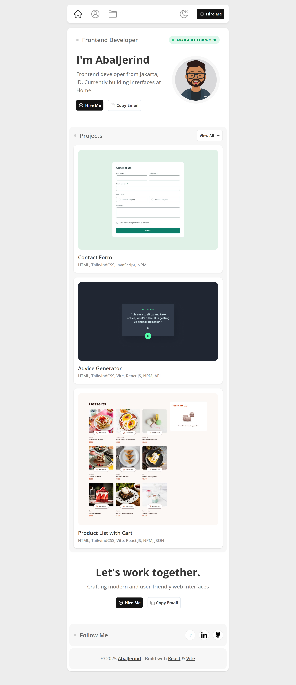
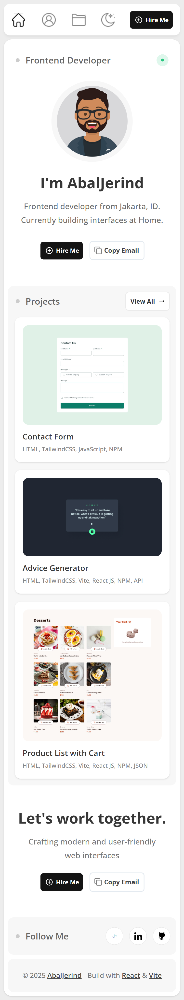

# Portofolio Jerind

This repository contains my professional portfolio website, built using React.js with Vite for optimized performance and Tailwind CSS for modern, responsive styling. It serves as a showcase of my projects, skills, and experience, demonstrating my expertise in front-end development.

## Table of contents

- [Features](#features)
  - [Installation](#installation)
  - [Clone the Repository](#clone-the-repository)
  - [Screenshot](#screenshot)
  - [Links](#links)
- [My process](#my-process)
  - [Built with](#built-with)
  - [Useful resources](#useful-resources)
- [Author](#author)
- [Acknowledgments](#acknowledgments)

## Features

- ⚡ Fast development with Vite
- 🎨 Styled using Tailwind CSS
- 🖥️ Fully responsive design
- 🚀 Optimized for performance

## Installation

Make sure you have **Node.js** and **Yarn** installed on your system.

### Clone the Repository

```sh
git clone https://github.com/Abaljerind/portofolio-jerind.git
cd your-repo-name
```

- Install Dependencies

```sh
yarn
```

- Run Development Server

```sh
yarn dev
```

- Build for Production

```sh
yarn build
```

- Preview Production Build

```sh
yarn preview
```

### Screenshot

- Desktop version
  

- Mobile version
  

### Links

- Solution URL: [Github](https://github.com/Abaljerind/portofolio-jerind)
- Live Site URL: [Live Site](https://portofolio-jerind.vercel.app/)

## My process

### Built with

- Semantic HTML5 markup
- Flexbox
- Mobile-first workflow
- Yarn (for package management)
- [React](https://reactjs.org/) - JS library
- [Vite](https://vite.dev/) - React framework
- [TailwindCSS](https://tailwindcss.com/) - CSS framework

### Useful resources

- [TailwindCSS](https://tailwindcss.com/) - This helped me to do the styling more easy. I really liked this TailwindCSS and will use it going forward.
- [Vercel](https://vercel.com) - This is an amazing website which helped me to deploy my website to the internet. I'd recommend it to anyone who still learning to use this website.

## Author

- LinkedIn - [@AbalJerind](https://www.linkedin.com/in/abal-jerind-baa90519a/)
- Github - [@Abaljerind](https://github.com/Abaljerind)

## Acknowledgments

I want to thank me for believing in me, I want to thank me for doing all this hard work. I wanna thank me for having no days off. I wanna thank me for never quitting. I wanna thank me for being me at all times.
